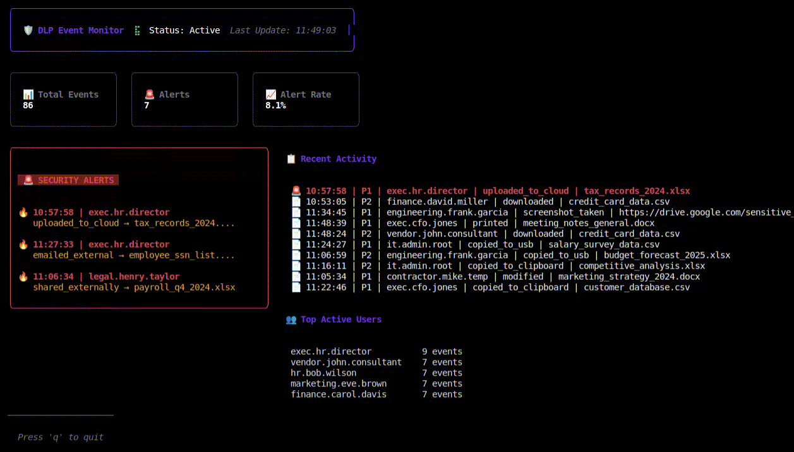

# DLP Event Monitor

A real-time Data Loss Prevention (DLP) event monitoring system built to practice my Go skills and learn about rate limiting and DLP detection. This system would be receiving events from clients in real-time and flagging suspicious activity.

## Overview

This event monitor simulates a corporate environment with role-based users generating events through Markov chain behavior models. It uses adaptive statistical learning to detect anomalous behavior that may indicate data exfiltration or security violations, presenting results in a real-time TUI dashboard.

## Features

### Corporate Hierarchy & Role-Based Behavior
- **Role-Based Users**: CEO, Engineers, Contractors, HR, Finance, IT Admin
- **Markov Chain Behavior**: Each role follows probabilistic action patterns
- **Realistic Activity**: Users generate events based on role-appropriate behavior

### Adaptive Statistical Anomaly Detection

The system uses an adaptive learning approach that builds per-user baselines and flags anomalies using statistical methods:

**Learning Phase**: 
- First 50 events per user are used to establish baseline behavior
- No alerts are generated during this learning period
- System tracks action rates, patterns, and timing for each user

**Detection Phase**:
- Uses Exponential Moving Average (EMA) to track recent trends
- Calculates standard deviation from learned baselines
- Flags activity that exceeds `mean + (3 × stddev)` or `EMA + (3 × stddev)`
- Adapts to each user's normal behavior patterns

**Sliding Window**:
- Tracks activity within a configurable time window (default: 5 minutes)
- Uses adaptive thresholds based on learned user behavior
- Monitors: downloads, USB copies, external actions, sensitive resource access

**Policy Violations** (always flagged):
- Sensitive resources shared externally
- Contractors accessing sensitive data

### Real-Time Dashboard

To present it all we've put together a TUI built with [Bubble Tea](https://github.com/charmbracelet/bubbletea) which shows an event stream of the events as they come in, any alerts generated, and some basic alert rate metrics.

### Architecture

- **Producer-Consumer Pattern**: Each user has their own producer goroutine generating role-based events via Markov chains
- **Adaptive Baseline Learning**: Per-user statistical models that learn normal behavior patterns
- **Sliding Window Algorithm**: Time-based activity tracking with adaptive thresholds
- **Statistical Detection**: EMA and standard deviation-based anomaly detection
- **Channel-Based Processing**: Concurrent event filtering and alert generation

## Installation

### Prerequisites

- Go 1.24.3 or higher

### Build

```bash
go mod download
go build -o dlp-monitor main.go
```

### Run

```bash
./dlp-monitor
```

Or directly with Go:

```bash
go run main.go
```

## Project Structure

```
.
├── main.go              # Application entry point
├── config/              # Configuration (detection thresholds, window settings)
│   └── config.go
├── event/               # Event data structures
│   └── event.go
├── producer/            # Event producers with role-based Markov chains
│   ├── producer.go      # UserProducer with role-based behavior
│   ├── role.go          # Role definitions and Markov chain models
│   └── users.go         # Corporate user generation
├── filter/              # Adaptive anomaly detection
│   ├── filter.go        # Main filtering logic
│   └── baseline.go      # Per-user baseline learning and statistics
├── tui/                 # Terminal user interface
│   ├── tui.go
│   └── styles.go
└── consumer/            # Alert consumer (optional)
    └── consumer.go
```

## Configuration

Detection parameters are configurable via `config.DefaultConfig()`:

- **MinLearningEvents**: Events before detection starts (default: 50)
- **StdDevMultiplier**: Standard deviation multiplier for thresholds (default: 3.0)
- **EMAAalpha**: EMA smoothing factor (default: 0.1)
- **MaxSamples**: Recent samples kept for stddev calculation (default: 20)
- **Window Duration**: Sliding window time period (default: 5 minutes)

## Technology Stack

- **Language**: Go
- **UI Framework**: [Bubble Tea](https://github.com/charmbracelet/bubbletea)
- **Styling**: [Lipgloss](https://github.com/charmbracelet/lipgloss)

## Demo
